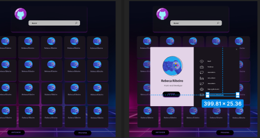

<h2 align="center">Tópicos 📋</h2>

   <p>
   
   - [Sobre 📖](#sobre-)
   - [Layout 🎨](#layout-)
   - [Como Usar 🤔](#como-usar-)

   </p>

---

<h2 align="center">Sobre 📖</h2>
   
<p>
   O projeto  desenvolvido trata-se de uma aplicação integrada com o GitHub onde é possível realizar buscas de
   usuários da plataforma e visualizar informações básicas do mesmo. <br>
</p>

---

<h2 align="center">Layout 🎨</h2>

   <p align="center">
      
   </p>

   <p align="center">
      O Layout foi desenvolvido por <a href="https://www.linkedin.com/in/rebeca-ribeiro-044374173/">Rebeca Ribeiro</a>, e você pode acessá-lo no Figma:
   
   - <a href="https://www.figma.com/file/FU5UANvDlsS9Zbn6bbp2vn/Teste-Caiena?type=design&node-id=6-1006&t=QxvVaoMtO4T22ON3-0">Front</a> 📱
   </p>

# Paleta de cores

color: $clr-primary:; //Exemplo de uso

| Nome da Cor                | Hexadecimal |
| -------------------------- | ----------- |
| $clr-primary | ![#19141C]   |
| $clr-secondary| ![#351349] |
| $clr-tertiary| ![#837E9F]  |
| $clr-bg-card | ![rgba(0, 0, 0, 0.632)] |
| $clr-pink    | ![rgb(237, 0, 170)] |
| $clr-light| ![#E2D3E7]     |
| $clr-btn     | ![rgba(101, 80, 172, 1)] |
| $clr-black   | ![balck] |

---

<h2 align="center">Como Usar 🤔</h2>

```
- Clone esse repositório:
$ git clone https://github.com/rebecasouzacoder/github-project.git

- Entre no diretório:
$ cd  github-project

- Instale as dependências:
$ npm i

- Inicie o app:
$ npm run start
```

---

<!--END_SECTION:footer-->
